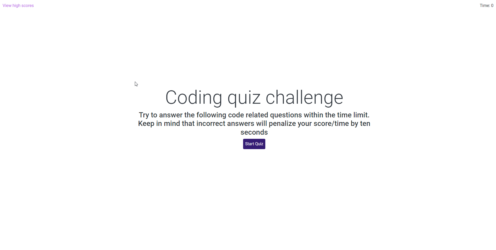

# Challenge 4: Coding quiz
This website is a small coding quiz made in HTML and Javascript. 
This website uses both Bootstrap and jQuery for its primary functionality.

Features:
- Leaderboard stored in localStorage for data persistence.
- Timer and score tracking.
- (Internal) Ability to specify any number of answers to a question.

Live URL: https://stratiz.github.io/challenge-4-coding-quiz/

